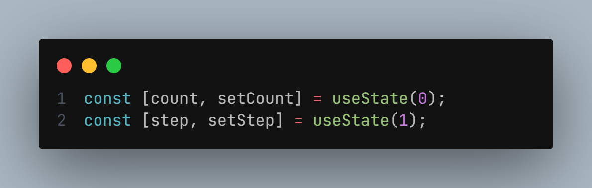
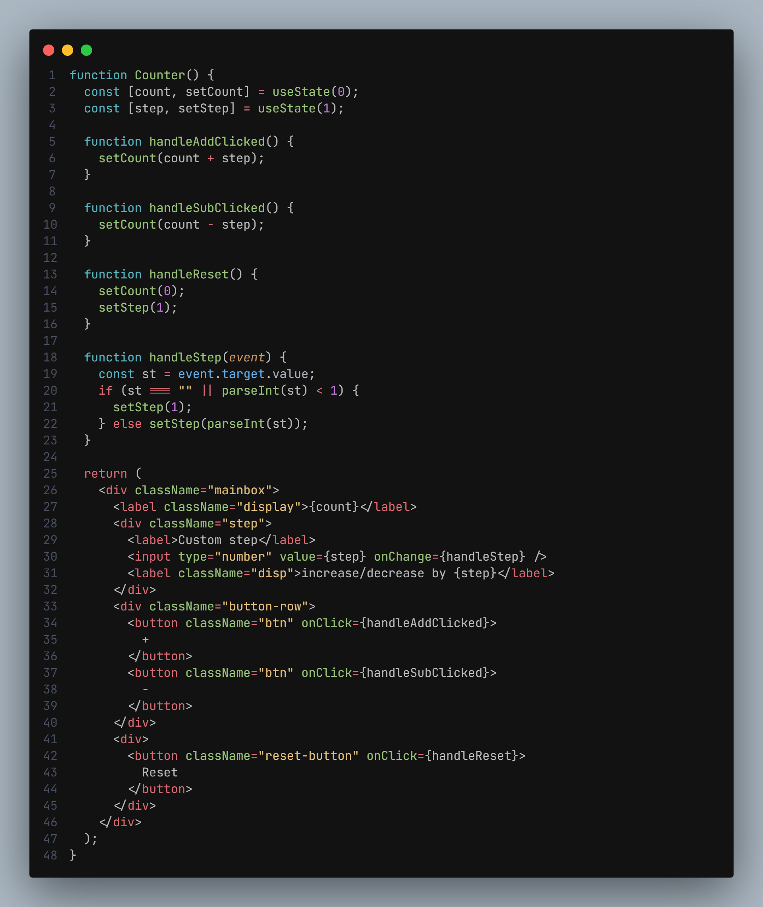
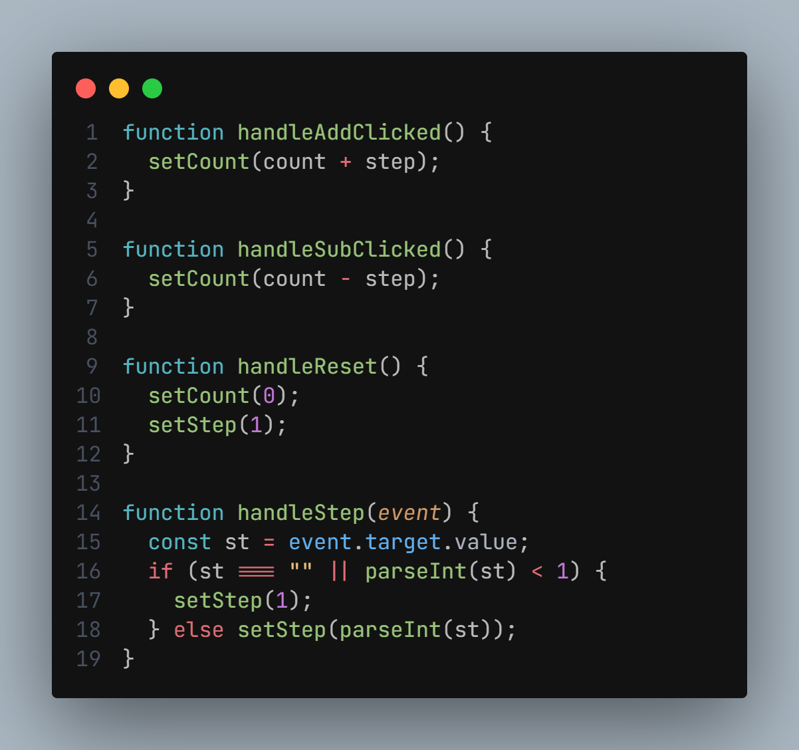
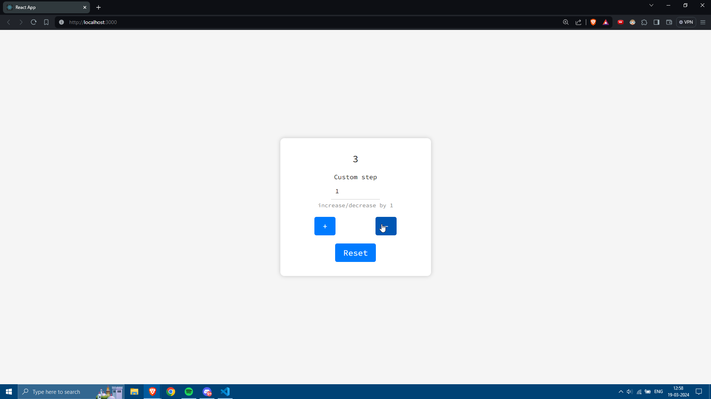
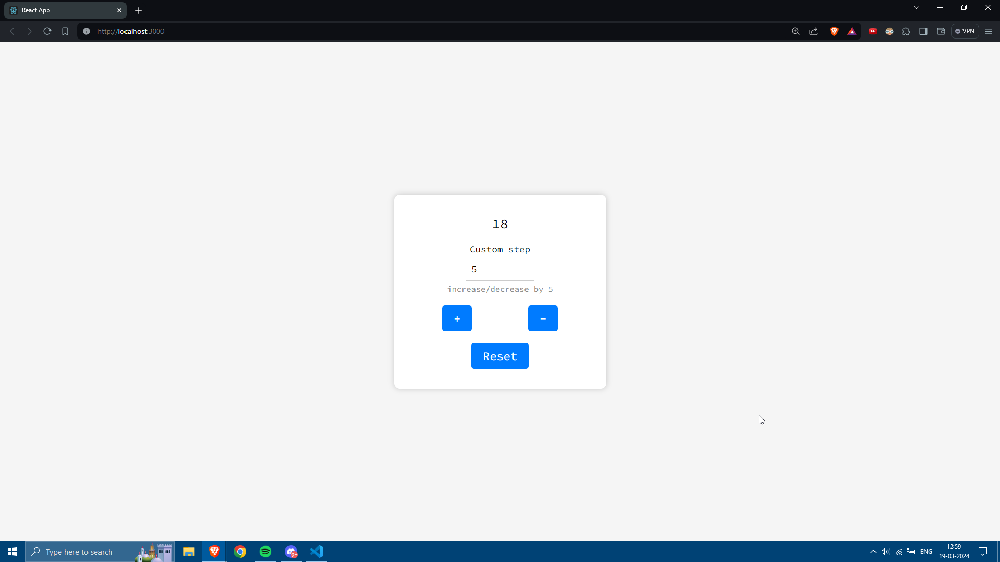
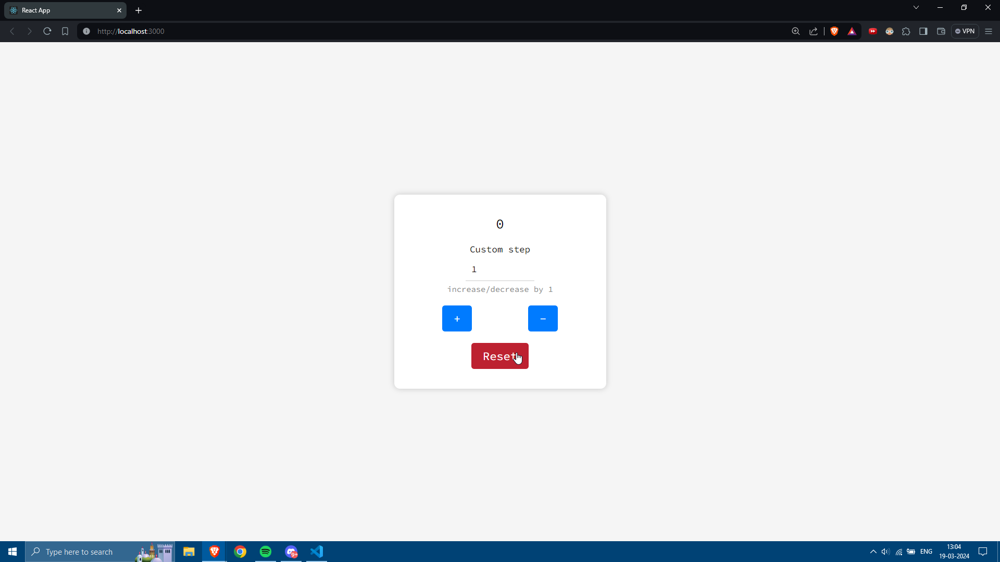

# Counter App - React

This is a simple React application consisting of a single component called Counter. The component utilizes React hooks, specifically useState, to manage its state and update the count based on user interactions.

## Getting Started

To use the Counter component in your React application, follow these steps:

- Clone or download the repository containing the Counter component code.
- Copy the App.js file into your project directory.
- Import the Counter component into your desired React component file.

## State Management

- **count**: Represents the current count value displayed in the UI. It starts at 0 and can be incremented or decremented.
- **step**: Represents the custom step value for incrementing or decrementing the count. Its default value is 1.

## Component

The application contains a single functional component: **Counter**

This component renders the main interface of the counter application. It includes labels for the count and custom step, input fields for adjusting the step value, buttons for incrementing and decrementing the count, and a reset button to restore the count to its default state.

## Logic

- handleAddClicked: Increments the count by the current step value when the "+" button is clicked.

- handleSubClicked: Decrements the count by the current step value when the "-" button is clicked.

- handleReset: Resets the count to 0 and the step value to 1 when the "Reset" button is clicked.

- handleStep: Updates the step value based on user input in the custom step input field. If the input is empty or less than 1, it defaults the step value to 1.

## Screenshots

- Initial Look:
  

- Using + and - Buttons:
  

- Using Custom Step:
  

- On Reset:
  

## Contributing

If you encounter any issues or have suggestions for improvements, feel free to open an issue or submit a pull request on the GitHub repository.

---

This README provides a basic overview of the Accordion component, including instructions for usage, customization, contributing, and screenshots demonstrating its functionality. If you have any further questions or need assistance, don't hesitate to ask!
